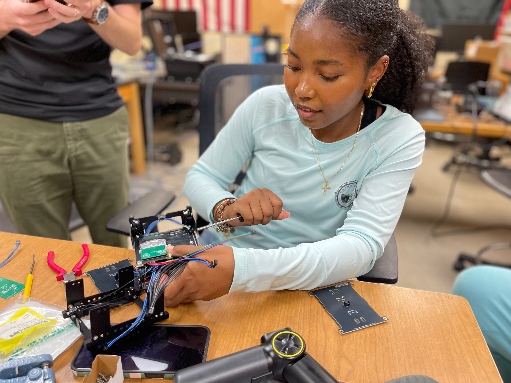
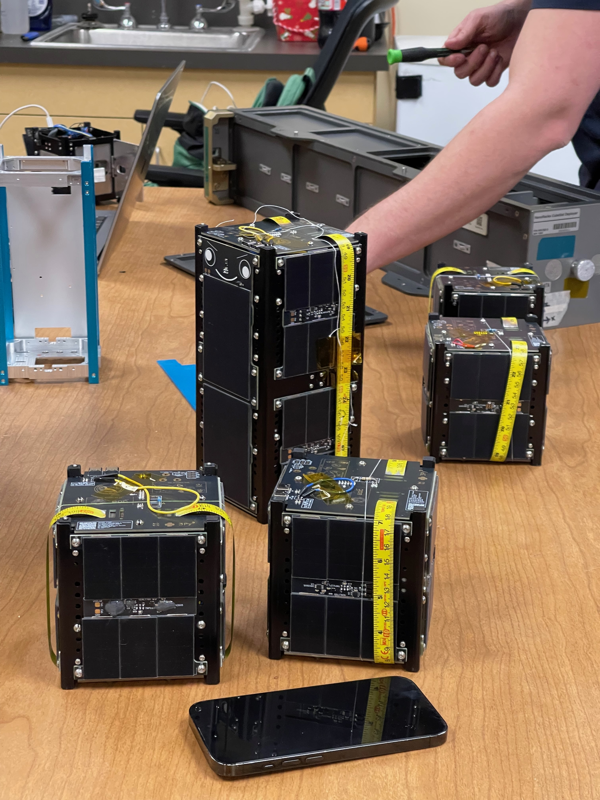
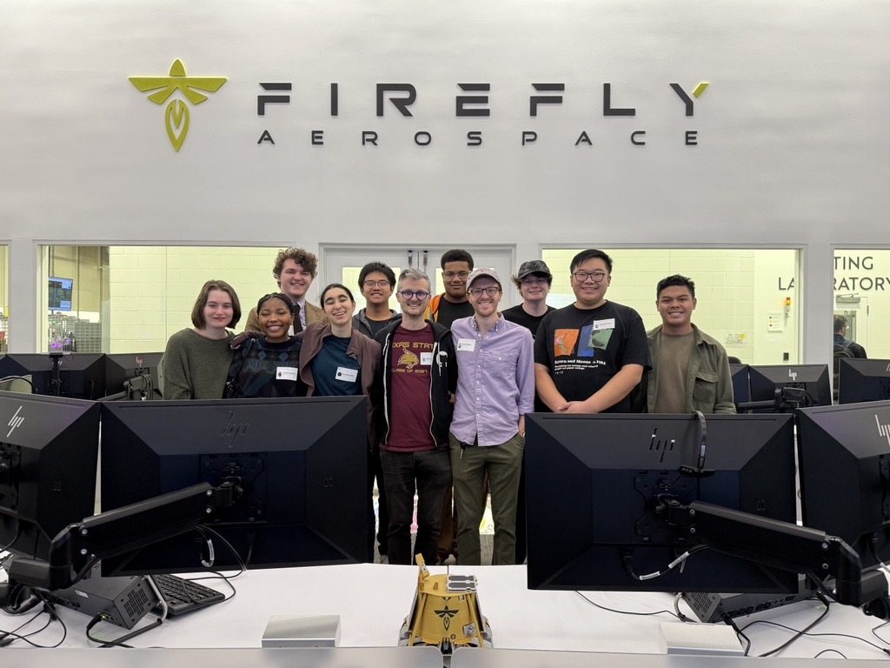
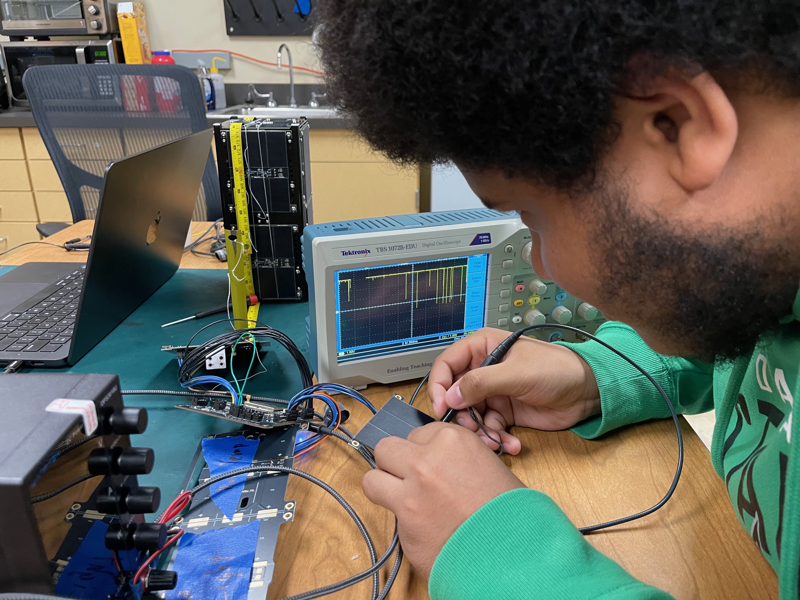

---
# try also 'default' to start simple
theme: dracula
background: ./images/spacecraft_above_earth.avif
title: Texas State Space Lab – Recruiting Software Engineers
info: |
  Recruitment talk for Girls Who Code and .EXE at Texas State.
  Audience: CS undergrads who already know how to program.
class: text-center
drawings:
  persist: false
transition: slide-left
mdc: true
duration: 5min
---

# Texas State Space Lab

Build and operate real spacecraft • C++ • Python • Java • Linux

<!--
- 5 minute presentation plus questions.
-->

---

# About Me

  

    <ul>
      <li><strong>Nate Gay</strong>, Sr. Staff Software Engineer at WP Engine</li>
      <li>TXST Space Lab <strong>Software Lead</strong></li>
      <li><strong>Math major</strong> at Texas State</li>
    </ul>
  

  

    
  

<!--
- Decade of experience writing software professionally.
- Formal methods interest.
- The picture is of me, my partner Danielle, and our dog Chippy.
-->

---

# What Is the Texas State Space Lab?

  

    <ul>
      <li>2‑year‑old <strong>research lab</strong> in the Physics Department</li>
      <li>Mission: build Texas State’s <strong>space research capabilities</strong></li>
      <li>Prepare students for <strong>space industry careers</strong></li>
    </ul>
  

  

    
  

<!--
- Two‑year‑old research lab in the Physics Department.
- Grow Texas State’s research capabilities in space.
- Prepare students—like you—for careers in the space industry.
- The picture is of Jasmine assembling a satellite engineering model in the TXST Space Lab.
-->

---

# Your Code, in Space

  

    <ul>
      <li>Recruiting <strong>2 - 5</strong> engineers for the software team</li>
      <li>Flying on <strong>6 missions</strong> in <strong>2026</strong></li>
      <li>Building <strong>ground station software</strong> this semester</li>
    </ul>
  

  

    
  

<!--
- Space Lab Software Team is recruiting 2–5 engineers this semester.
- Our software will fly on six missions in 2026.
- Our ground station will need to be operational by May 2026 when the first satellites are deployed from the ISS.
- The picture is of five flight satellites during integration prep at the TXST space lab
-->

---

# Opportunities You Get

  

    <ul>
      <li>Space events &amp; conferences: <strong>Astro Awards</strong>, <strong>CubeSat Dev Workshop</strong>, <strong>SmallSat</strong></li>
      <li><strong>JPL</strong> software workshops &amp; <strong>Firefly</strong> tours</li>
      <li>Collaborate with <strong>NASA</strong>, <strong>JPL</strong>, and industry partners</li>
    </ul>
     
    
  

  

    
  

<!-- 
- TXST Space Lab is growing its reputation in Texas and nationally through our partnerships with other universities.
- We attend space industry events and conferences.
- We get to visit industry partners like Firefly Aerospace and NASA JPL.
- The first picture is of the TXST Space Lab team with Tim Dodd at the Astro Awards
- The second picture is of the TXST Space Lab team at Firefly Aerospace in Cedar Park, TX
-->

---

# What You’ll Do This Semester

  

    <ul>
      <li>Work with <strong>F´</strong>, <strong>YAMCS</strong>, and hardware‑in‑the‑loop tests</li>
      <li>Write <strong>C++</strong>, <strong>Python</strong>, <strong>Java</strong></li>
      <li>Help with <strong>integration</strong> and debugging on real hardware</li>
      <li>Prepare the Cal Poly Pomona and TXST satellites for <strong>launch</strong></li>
      <li>Build out TXST's <strong>ground station</strong> software and operations capabilities</li>
    </ul>
  

  

    
    <!--  -->
    <!--  -->
    <!--  -->
  

<!-- 
- Learn industry software
- This is applied science and math
- The picture is of Saidi testing magnetorquer output so we can program the detumbling system
-->

---

# Is This You?

  

    <ul>
      <li>Already know how to <strong>code</strong></li>
      <li><strong>Code for fun</strong> outside of class</li>
      <li>Can commit <strong>~10 hours/week</strong></li>
      <li>Have a <strong>Linux</strong> or <strong>Mac</strong> laptop you use for programming</li>
      <li>Have at least <strong>two full semesters</strong> left at TXST</li>
    </ul>
  

  

    <video controls class="rounded-lg shadow-lg" preload="metadata">
      <source src="./images/maia_assembly_timelapse.mp4" type="video/quicktime">
      Your browser does not support the video tag.
    </video>
    
Timelapse of PROVES - Maia satellite assembly in a clean room at TXST

  

<!--
- PLAY THE VIDEO
- Already know how to code
- Code for fun
- Can commit ~10 hours/week
- Have a Linux or Mac laptop you use for programming
- WSL is not an adequate substitute
- Have at least two full semesters left at TXST
- This video is a timelapse of the PROVES - Maia satellite assembly in a clean room at TXST
-->

---

# How to Apply

  

    <ul>
      <li>Timeline
        <ul>
          <li>Application due <strong>Sunday, February 8 by 11:59pm</strong></li>
          <li>Interviews <strong>February 9-11</strong></li>
          <li>Decisions announced <strong>Sunday, February 15</strong></li>
        </ul>
      </li>
      <li>Prepare
        <ul>
          <li>Mastery of the language of <strong>your choice</strong></li>
          <li><strong>Data structures</strong> &amp; <strong>algorithms</strong></li>
        </ul>
      </li>
      <li>Questions?</li>
    </ul>
  

  

    
  

